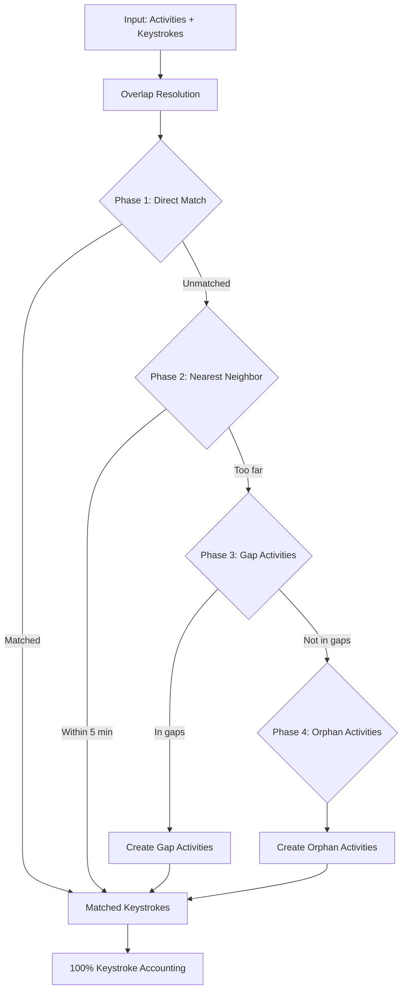

# 4-Phase Keystroke Matching Algorithm Reference

## Executive Summary

The 4-Phase Keystroke Matching Algorithm is a sophisticated approach that achieves 100% keystroke accounting by matching keystrokes to activities through multiple strategies, creating synthetic activities when necessary. This document serves as the authoritative reference for the algorithm's implementation.

## Algorithm Overview



## Key Problems Solved

1. **Overlapping Activities** (e.g., Chrome 9:00-9:15, VS Code 9:10-9:20)
   - Solution: Trim earlier activity to end when next begins (Chrome ends at 9:10)

2. **Gaps in Activity Tracking** (e.g., no activities from 10:00-10:30 but keystrokes exist)
   - Solution: Create synthetic "gap" activities for these periods

3. **Orphaned Keystrokes** (keystrokes far from any activity)
   - Solution: Group into synthetic "orphan" activities

4. **Cross-Application Typing** (active window is Chrome but typing in VS Code)
   - Solution: Track as cross-app keystrokes for behavioral insights

## Detailed Phase Descriptions

### Phase 0: Activity Overlap Resolution (Preprocessing)

**Purpose**: Prevent double-counting of keystrokes by trimming overlapping activities.

**Algorithm**:
```python
# If Activity A ends after Activity B starts, trim A to end at B's start
if activities[i].end > activities[i+1].start:
    activities[i].end = activities[i+1].start
```

**Example**:
- Before: Chrome (9:00-9:15), VS Code (9:10-9:30)
- After: Chrome (9:00-9:10), VS Code (9:10-9:30)

### Phase 1: Direct Temporal + Application Match

**Purpose**: Match keystrokes that clearly belong to an activity.

**Conditions**:
1. Keystroke timestamp ≥ Activity start time
2. Keystroke timestamp ≤ Activity end time
3. Keystroke app == Activity app (normalized)


### Phase 2: Nearest Neighbor with App Preference

**Purpose**: Match nearby keystrokes to activities within reasonable distance.

**Parameters**:
- **Maximum Distance**: 300 seconds (5 minutes)
- **App Penalty**: 180 seconds (3 minutes) for different apps

**Algorithm**:
1. Find all activities within 300 seconds of keystroke
2. Calculate effective distance:
   - Same app: actual_distance
   - Different app: actual_distance + 180 seconds
3. Choose activity with minimum effective distance
4. Only match if effective distance ≤ 300 seconds


### Phase 3: Gap Synthetic Activities

**Purpose**: Create activities for gaps between real activities where keystrokes exist.

**Algorithm**:
1. Identify gaps between consecutive activities
2. Find keystrokes within each gap
3. Group keystrokes by application
4. Create synthetic activity for each app group

**Properties**:
- `is_synthetic`: true
- `is_gap`: true
- `is_orphan`: false


### Phase 4: Orphan Synthetic Activities  

**Purpose**: Group remaining unmatched keystrokes into synthetic activities.

**Algorithm**:
1. Group remaining keystrokes by application
2. Within each app group, merge keystrokes within 5 minutes of each other
3. Create synthetic activity for each group

**Properties**:
- `is_synthetic`: true
- `is_gap`: false
- `is_orphan`: true


## Key Implementation Details

### App Normalization

The algorithm uses normalized app names for matching:

```python
def normalize_app_name(exec_path: str) -> str:
    """
    Normalize application names across platforms.
    Examples:
    - 'C:\\Program Files\\Google\\Chrome\\Application\\chrome.exe' → 'chrome'
    - '/Applications/Visual Studio Code.app/Contents/MacOS/Electron' → 'code'
    - 'Microsoft.WindowsTerminal_8wekyb3d8bbwe' → 'terminal'
    """
```

**Key Mappings**:
- `Electron` → `code` (VS Code on Mac)
- `cmd.exe` → `terminal`
- `WindowsTerminal` → `terminal`
- Various browser executables → canonical names

### Cross-App Keystroke Detection

Identifies when users type in a different application than the active window:

```python
cross_app_count = sum(
    1 for ks in keystrokes 
    if ks.app != activity.app and not activity.is_synthetic
)
```

**Use Cases**:
- Typing in VS Code while Chrome is active (dual monitors)
- Command line usage while documentation is open
- Chat applications in background

### URL and Title Preservation

Synthetic activities preserve metadata from keystrokes:

```python
# For gap/orphan activities:
activity["title"] = keystroke.get("title", "")  # Often contains URL
activity["url"] = keystroke.get("url", "")      # Direct URL field
```

## Performance Characteristics

### Time Complexity

| Phase | Complexity | Description |
|-------|------------|-------------|
| Overlap Resolution | O(n log n) | One-time sort + linear scan |
| Phase 1 | O(n × m) | n activities × m keystrokes |
| Phase 2 | O(k × n) | k unmatched × n activities |
| Phase 3 | O(k log k) | Grouping operations |
| Phase 4 | O(k log k) | Grouping operations |

Where:
- n = number of activities
- m = number of keystrokes
- k = number of unmatched keystrokes

### Memory Usage

- Processes one user at a time
- Lazy evaluation until collection needed
- Typical usage: ~500MB per user

## Configuration Parameters

| Parameter | Value | Description |
|-----------|-------|-------------|
| Nearest Neighbor Distance | 300s (5 min) | Maximum distance for Phase 2 matching. |
| App Penalty | 180s (3 min) | Additional distance applied before choosing a different-app match. |
| Orphan Grouping Gap | 5 min | Minimum separation that triggers a new orphan group. |
| Workblock Min Duration | 5 min | Minimum duration for workblocks considered valid. |
| Pattern Limit | 200,000 | Upper bound on patterns processed per user to protect memory usage. |

## Quality Metrics

The algorithm reports detailed statistics:

```
Keystroke Matching Statistics:
  Total keystrokes: 1,234
  Phase 1 (exact match): 1,000 (81.0%)
  Phase 2 (nearest): 150 (12.2%)
  Phase 3 (gap synthetic): 50 (4.1%)
  Phase 4 (orphan synthetic): 34 (2.8%)
  Total matched: 1,234 (100.0%)
  
  Quality metrics:
    - Cross-app matches: 45
    - Synthetic activities created: 12
```

## Edge Cases Handled

1. **Empty Data**
   - Users with no activities → All keystrokes become orphans
   - Users with no keystrokes → Skipped (optional)

2. **Data Quality Issues**
   - Duplicate keystroke IDs → Deduplicated
   - Mixed user ID types → Cast to string
   - Null/missing fields → Default values applied

3. **Extreme Cases**
   - Very long activities (24+ hours) → Handled normally
   - Thousands of tiny gaps → Grouped efficiently
   - Massive keystroke bursts → Pattern limiting applied


## Detailed Examples

### Example 1: Complete 4-Phase Flow
```python
# Input Activities (after overlap resolution)
user_id | start               | end                 | name    | app_filename
123     | 2024-01-01 09:00:00 | 2024-01-01 09:30:00 | Chrome  | chrome.exe
123     | 2024-01-01 11:00:00 | 2024-01-01 11:30:00 | VS Code | code.exe

# Input Keystrokes
user_id | datetime            | exec        | url
123     | 2024-01-01 09:15:00 | chrome.exe  | gmail.com     # Phase 1
123     | 2024-01-01 09:35:00 | chrome.exe  | github.com    # Phase 2  
123     | 2024-01-01 10:00:00 | slack.exe   | NULL          # Phase 3
123     | 2024-01-01 07:00:00 | notepad.exe | NULL          # Phase 4

# Results
Phase 1: 1 match (direct temporal + app)
Phase 2: 1 match (nearest neighbor to Chrome)
Phase 3: 1 gap activity created (Slack 10:00-10:00)
Phase 4: 1 orphan activity created (Notepad 07:00-07:00)
Total: 100% keystroke matching
```

### Example 2: Cross-App Detection
```python
# Activity: Chrome (9:00-9:30)
# Keystroke: code.exe at 9:15

# Result:
- Matched to Chrome activity (Phase 1 temporal match)
- Marked as cross-app keystroke
- Indicates user was typing in VS Code while Chrome was active window
```

### Example 3: URL Preservation in Synthetic Activities
```python
# Keystrokes with URLs
datetime            | exec       | url
2024-01-01 10:00:00 | chrome.exe | github.com/project
2024-01-01 10:05:00 | chrome.exe | github.com/issues

# Gap activity created:
{
    "name": "chrome",
    "title": "github.com/project",  # Preserved from keystroke
    "url": "github.com/project",     # Preserved from keystroke
    "is_synthetic": true,
    "is_gap": true
}
```
